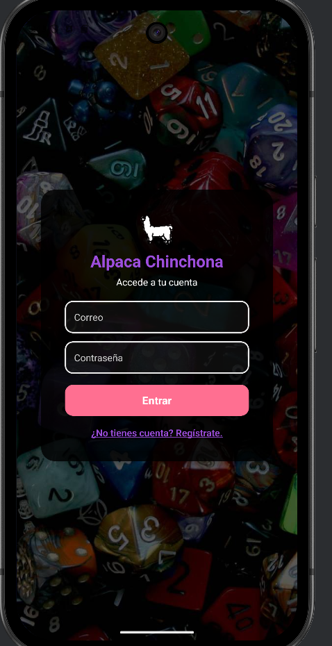
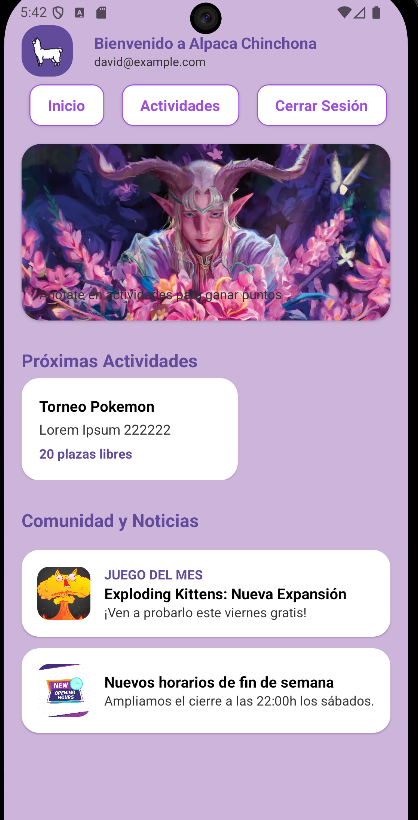
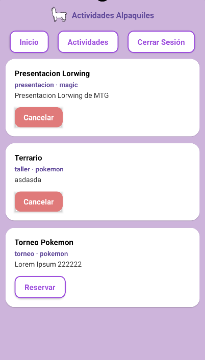
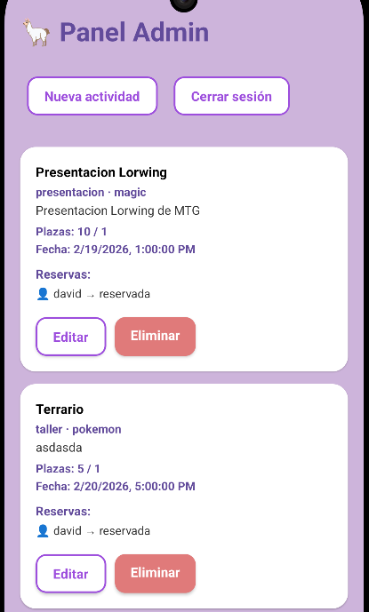
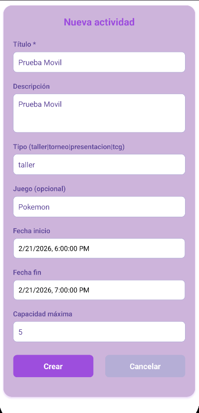
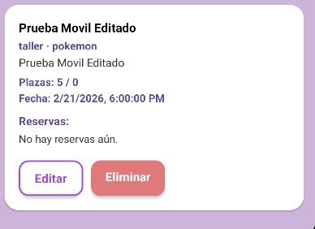
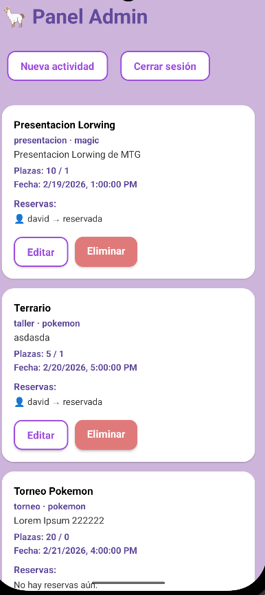
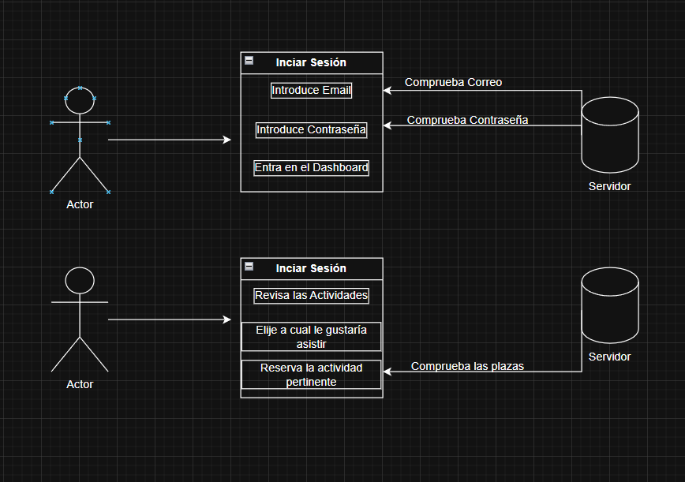

# Alpaca Chinchona React Native

En esta aplicación vamos he creado una aplicación la cual gestiones las diferentes actividades de una tienda de juegos de mesa y TCG's (Juegos de Cartas Coleccionables) en la cual se hacen diferentes actividades a lo largo de la semana, algunas de estas actividades pueden ser:

- Torneos de Cartas.
- Partidas de Warhammer 40.000.
- Mesas de Rol en Vivo.
- Talleres de artesanias como hacer tu propio terrario.

## Tecnologías

- React Native: FrameWork de interfaces y librerías de componentes.
- Routing: Expo-router para navegar frente a la App.
- Modulos Expo · API's: Para tener acceso en las API's
- AXIOS: Para comunicación HTTP

## Vista de la Aplicación

### Login

Donde nos loguearemos y dependiendo de nuestro rol como usuario nos llevará hacia el panel de usuario "Dashboard" o el panel de "Admin"

### Dashboard

El Dashboard es el panel para cada uno de los usarios "normales" donde pueden ver las actividades que estan disponibles y donde podemos ver de reservar

Ahora vamos a dirigirnos a la vista de las actividades para ver como gestionamos las actividades.

### Actividades

Donde podemos que actividaeds tiene reservadas el usuario y si las que no, en este caso podemos ver que tiene dos actividades reservadas y una en la cual podría reservar.

### Panel Administrador

En el panel de adminsitrador tendremos todos las actividades y prodremos crear modificar y eliminar las diferentes actividades.

### Crear Actividad

En el cual si pulsamos en el panel Admin podemos darle a Nueva Actividad donde nos aparecerá el formulario de creación de nuestras actividades:

### Modificar la actividad

Pulsaremos en el boton de editar nos abrirá el mismo formulario que usamos para la creación de actividades pero en este caso tambein cogeremos y nos rellenara los campos de tal manera que simplemente le damos a actualizar y se modificará

Y ahora probaremos a eliminarlo

### Eliminar la actividad

Ahora vamos a eliminar la actividad que acabamos de crear, para ello simplemente vamos hacia la actividad y pulsamos en el boton de eliminar de tal manera que nos saldrá un modal que nos preguntará y en ese caso cogeremos y se eliminará la actividad recargando el resto de las actividades.

Por ultimo mostraremos un diagrama de casos de uso. que teemos en nuestra web

### Diagrama de Casos de Usos

Para el diagrama de casos de uso usare el caso de usos de iniciar sesion junto con el de reservar actividades.

